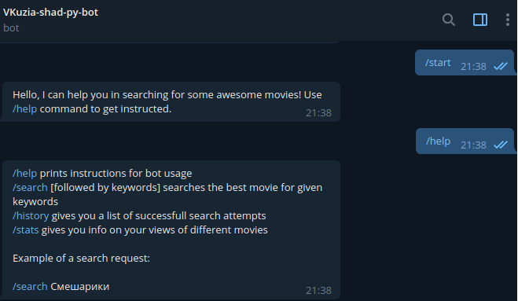
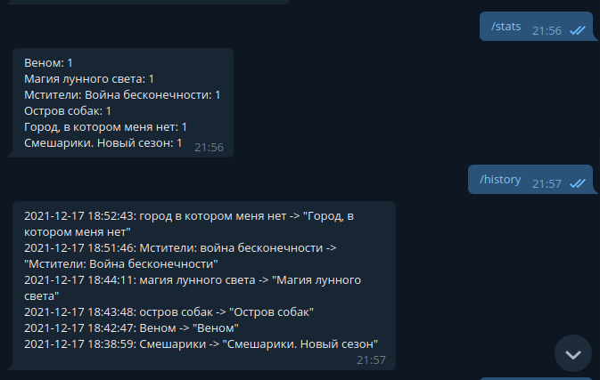
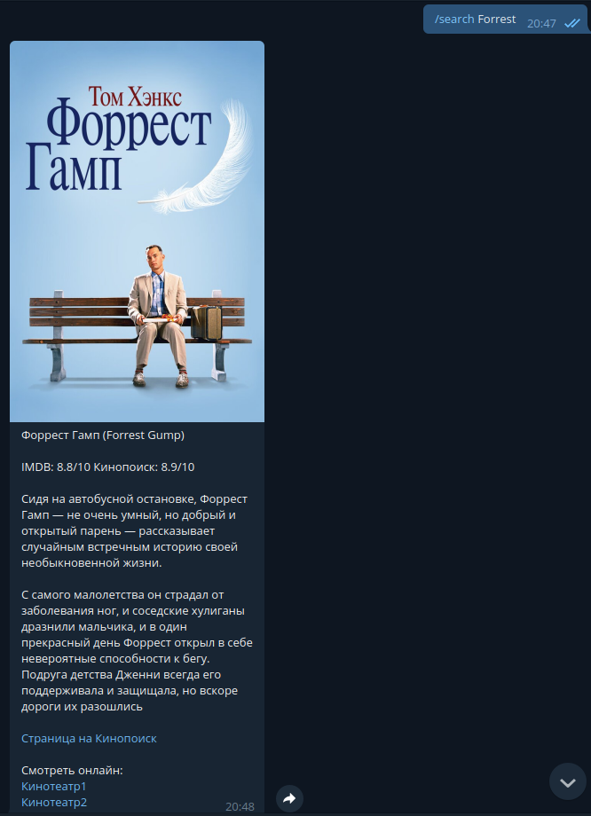
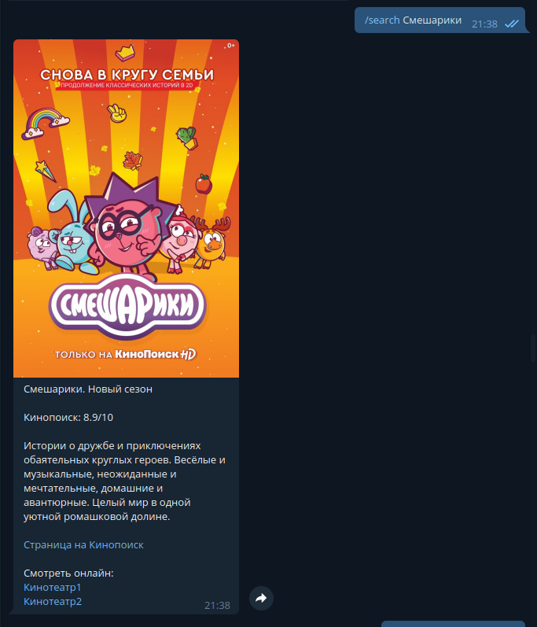

# Asynchronous Telegram-Bot for searching movies.
### This project is a part of YSDA Python course

This telegram bot allows to find some information about a movie by its name or keyword. 
Uses *aiogram*, *aiohttp* for basic web and telegram interaction, *sqlite3* is used as database and some
"serpapi" scrapping is involved.

You can find problem STATEMENTS_RU.md and INSTRUCTION_RU.md for more info in russian.

### Warning

This project is posted to Github in a "presentation mode", which means, the repo is just a ready made project pushed to the master branch :).
It is currently off, so if you'd like to see it working, you may look at pictures below or launch it yourself by configuring environment variables as in *dummy_env*.

### Possibilities

This bot takes your /search request and gives you brief info and imdb ratings on the first movie it will google (using *serpapi*).
It provides a link to *kinopoisk* service as well as 2 links to online movie theaters where you can watch them.
It also saves search history to a sqlite3 database instance. Average response time for my requests was about 4-5 seconds (the toughest part is to scrap links to online theaters).

### Examples of interaction (in russian)

|  |  |
| --- | --- |

|  |  |
| --- | --- |

### Important note

Have a nice day :)